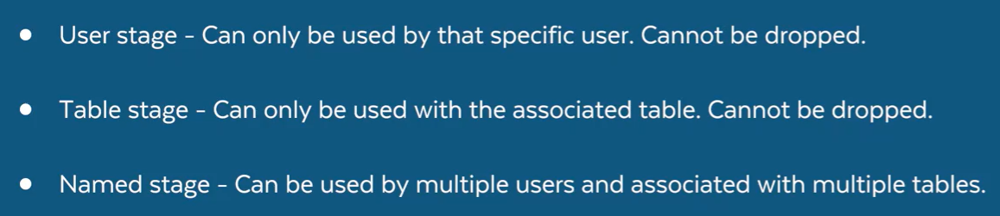

# Snowflake – Notes

## 1. What is Snowflake?
Snowflake is a **cloud-native data platform** designed for scalable data storage, processing, and analytics.

- Separates **storage and compute**, allowing multiple workloads to run independently on the same data without performance issues
- Fully managed (no infrastructure maintenance)
- Supports **structured and semi-structured data** (e.g., JSON)
- Key features include:
  - Automatic scaling
  - Time Travel
  - Secure data sharing

---

## 2. Why Snowflake over Traditional Databases?
Unlike traditional databases, Snowflake does **not require manual infrastructure management**.

Key advantages:
- Compute and storage are **decoupled**
- Better **scalability** and **concurrency**
- Improved **cost efficiency**
- Ideal for **modern cloud analytics workloads**

---

## 3. Data Loading
Refer to the following file for data loading examples:
- `Data_Loading.sql`

---

## 4. TastyBytes Dataset
Refer to the following file:
- `TasteyBytes.sql`

---

## 5. Snowflake Warehouses
**Virtual Warehouses** in Snowflake are independent compute clusters that provide the processing power to execute SQL queries.

- Handle computation only (querying, loading, transforming)
- Do **not** store data
- Multiple warehouses can access the same data simultaneously
- No performance impact between warehouses due to Snowflake’s compute-storage separation

Reference files:
- `warehouse.sql`
- `Warehouse_Tastybytes.sql`

---

## 6. Stages and Basic Ingestion
**Stages** in Snowflake are storage locations that act as an intermediary layer for loading and unloading data between Snowflake tables and storage.

- Can be **internal or external**
- Commonly used with `COPY INTO` commands
- Used for both data ingestion and export

- named stages are referenced by [@stagename]
- For table stages [@%stagename]
- For user stages [@~stagename]
- refer stages_2.sql file and stages_1.sql and stages_Pratctice

## 7. Database and Schema

### Database

* A **database** in Snowflake is a logical container used to organize schemas and database objects.
* It provides isolation, access control, and structure for data.
* One Snowflake account can have multiple databases.

**Create Database**

```sql
CREATE DATABASE sales_db;
```

**Show Databases**

```sql
SHOW DATABASES;
```

---

### Schema

* A **schema** is a logical grouping of database objects like tables, views, stages, and functions.
* Schemas exist **inside a database**.
* Used to organize objects and control access.

**Create Schema**

```sql
CREATE SCHEMA sales_db.raw_data;
```

**Show Schemas**

```sql
SHOW SCHEMAS IN DATABASE sales_db;
```

---
Refer to **Database and Schemas and Tables** SQL examples:

* `Database and Schemas and tables/D&S_1.sql`
### Tables

* Tables store structured data in rows and columns.
* Snowflake automatically manages storage, indexing, and optimization.

**Create Table**

```sql
CREATE TABLE sales_db.raw_data.orders (
  order_id INT,
  order_date DATE,
  amount NUMBER(10,2)
);
```

---

### Fully Qualified Object Name

* Snowflake objects can be referenced using:

```
DATABASE.SCHEMA.OBJECT
```

**Example**

```sql
SELECT * FROM sales_db.raw_data.orders;
```

---

### Context Commands

* Used to set default database and schema.

```sql
USE DATABASE sales_db;
USE SCHEMA raw_data;
```

After setting context, object names can be used without full qualification.

---

### Key Interview Points

* Database → top-level container
* Schema → logical grouping inside database
* Tables → store actual data
* Separation helps with security, organization, and access control

---


